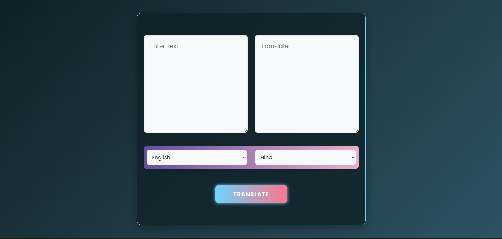

# Language Translator 🌐

A web application for translating text between multiple languages using the MyMemory Translation API (Google Translate alternative). Supports real-time language detection and selection.

## 🔧 Features
- Detect and translate between over 100 languages
- Dropdown selection for input/output languages
- Stylish and accessible UI

## 🚀 Technologies Used
- HTML, CSS, JavaScript
- MyMemory Translation API
- Netlify (for deployment)

## 📷 Screenshot

## 🌐 Live Demo
[Visit on Netlify](https://translexa.netlify.app/)

